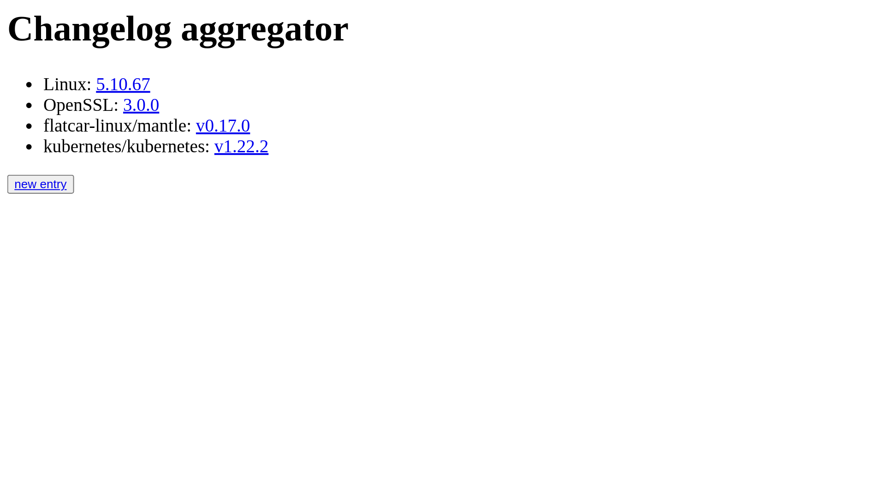
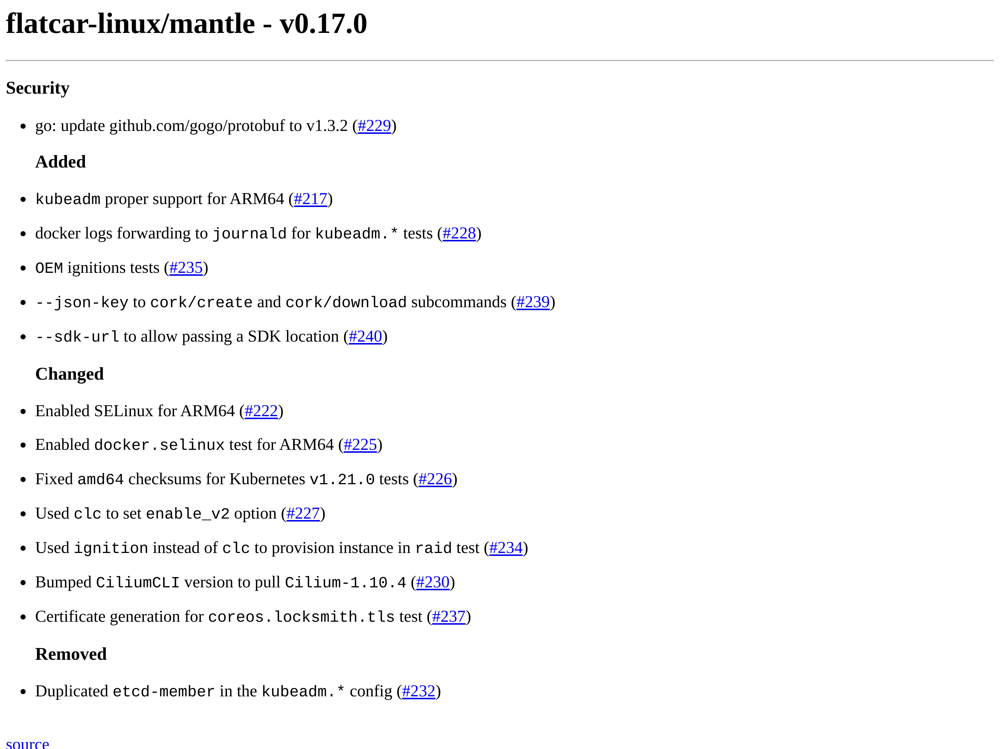

### Flog

For "Fetch (Change)Log" is a tool to centralize various changelog from different providers, from different locations into one single place.

#### Supported connectors

* `github`


#### Example

Starting with a fresh configuration, it's possible to inspect the available entries:



It's possible to inspect the changelog of a version by clicking on it:


=======
```
go run main.go
```

Visit: http://localhost:8080/
